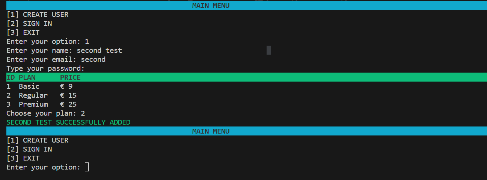
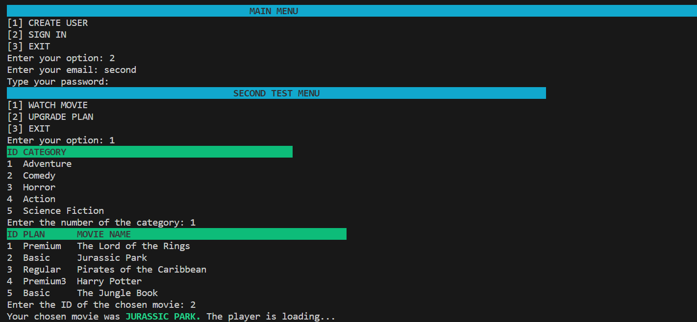
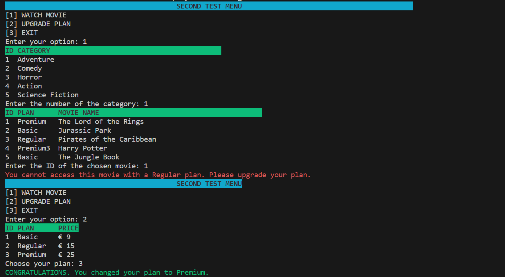

<h1 align="center">🖥️ Streaming System</h1>

### 📝 DESCRIPTION

<p align="justify">This program is a streaming system that utilizes SQLAlchemy for database interactions. It features a robust authentication system that verifies user credentials and their current subscription plan. The system ensures that users can only access movies that are compatible with their specific plan. Additionally, it provides users with the flexibility to upgrade their plans at any time, enhancing their viewing experience and access to a wider range of content. This system effectively combines user management and content access control, making it a comprehensive solution for a streaming service platform.</p>


### ⏭️ TABLE OF CONTENTS
1. Description
2. Requirements
3. Run the project
4. Contribute
5. Screenshots

### 💻 REQUIREMENTS
- [Python3](https://docs.python.org/3/)
- [VisualCode](https://code.visualstudio.com/docs)
-[SQLAlchemy](https://docs.sqlalchemy.org/en/20/)

### 🚀 HOW TO RUN THE PROJECT
```bash
$ pip install sqlalchemy
You will download the files and run the view.py script.
```


### 📫 HOW TO CONTRIBUTE
```bash 
# Fork this repository:
By clicking on the fork button on the top of this page. This will create a copy of this repository in your account.

# Clone this project:
git clone https://github.com/BLUCASS/Streaming_System

# Create a branch using the command:
git checkout -b your-new-branch-name

# Make the changes and commit them:
git commit -m "commit-message"

# Send them to the original branch:
git push file-origin project-name / local
```

### 📸 SCREENSHOTS
<br>
<br>
<br>